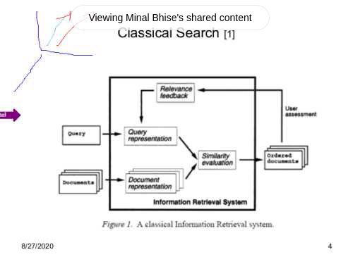
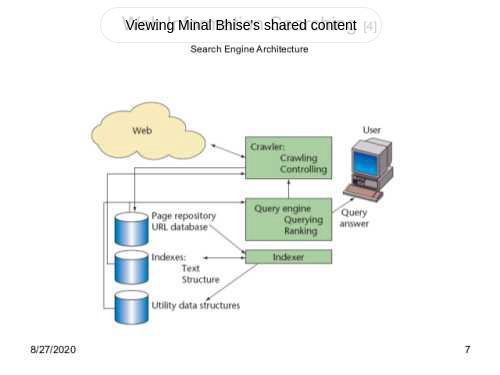

# Information Searching

- Traditional Search
- Web Search
- Metadata based Search
- Semantic Search (Intelligent Search)


### Traditional Search

- A collection of documents is a set of documents related to specific context of interest
- Indexing process is applied to full text of documents.
- Classical Search
  - Submit a query in the form of set of keywords
  - Searches for documents that matches the query
  - Partial matching is also possible



```
// A classical Information Retrieval system

query = [keywords]
Document = [keywords...] // Every document is represented in the form of set of keywords

documents = [Document1, Document2...]
result = []

forall document in documents:
  if query matches document:
    result.push(document)

result.sortby(no_of_keywords_matched) // Similarity Evaluation: Cosine function

print(result)

// Relevance Feedback

feedback = input("Get Feedback:") // i.e Adjusting queries to get more relevant result
give_feedback(feedback)

// Uses Vector Space Model
// N-dimensional system
// N coordinate i.e. N keywords

```

- Similarity evaluation algorithm (Vector Space Model) considers the keywords
to be independent of each other
- Manual intervention needed to judge 'goodness' of the results
- It is mainly keyword based retrieval

### Web Data

- Huge Data
- Surface web, Deep/Hidden/Invisible Web (500 times bigger)
- Semistructured database
- Heterogeneous data
- Volatality
  - Existence or disappearance of web pages and sites
  - Content modification (more than 25% pages change daily)
  - Data gathered by search engine will become stale quickly
  - Crawlers need to revisit web pages regularly
- Velocity
- Variety
  - Diversity in data: media, text, files, binary, pictures.
  - Anybody can upload data

### Web Information Searching



Data
- Page repo, URL database
- Indexes: Text Structure
- Utitlity data structures

Functionality
- Crawling; Crawl web
- Query engine; Query ranking/processing
- Indexing; create indexes

Search engines devotes big number of servers (e.g. 900-1000) to
crawl the web.

- Web Searching & Information Retrieval, IEEE Computing in Science and
Engineering, 2004
- Search engine index each web page by representing it by a set of
weighted keywords
- Using robots or spiders thta crawl through the web, search engines
pick up useful pages
- Indexing of these pages includes:
  - Removing all frequent or non-significant words (stop words: and, be)
  - Stemming removes all the derivational suffixes (retains root (think): thinking, thinkers, thinks)
  - Pages found are represented by a set of weighted keywords

### Crawler/Robot/Spiders/Ants

- Crawler is a program controlled by a crawl module that browses the web
- Collects documents by recursively fetching links from a set of start pages(seeds),
the received pages (or parts) are compressed and stored in page repository
- URL and their links form web graph, which can be used by crawler control module to decide furthur crawling
- To save space docID represents pages in the index
- Indexer processes pages collected by crawler.
- It decides which pages to index, duplicate documents are discarded
- Indexer builds index data structure for words (text idex) and for links
(structure index)
- Inverted index is built which contains for each word a sorted list of
tuples (such as docID and position in the document)

### Crawler

- A selection policy (40-70% of indexable web) that states which pages to
download
- A re-visit policy (uniform or proportional) that states when to check
for changes to the pages
- A politeness policy (considers network and server load) that states
how to avoid overloading Web sites
- A parallelization policy that states how to coordinate distributed Web
crawlers (overhead from parallelization, repeat download of same page)

### Query Engine

- Query Engine processes user queries and return matching answers
using ranking algorithm (Google: Page Rank)
- Algorithm produces numerical score expressing importance of the
answer with respect to query
- Utility data structures contains list of related pages, which can
facilitate search
- Various query independent as well as dependent data is used to decide
ranking (data of modification, site, number of links to other pages
or actual content of documents)
- Query dependent criteria include consine measure of similarity in
vector space model

Later: Metadata Model

### Ranking Algorithms for Search Engines

- Computational Costs
- Poor Ranking
- Search engine spamming

How to improve?
